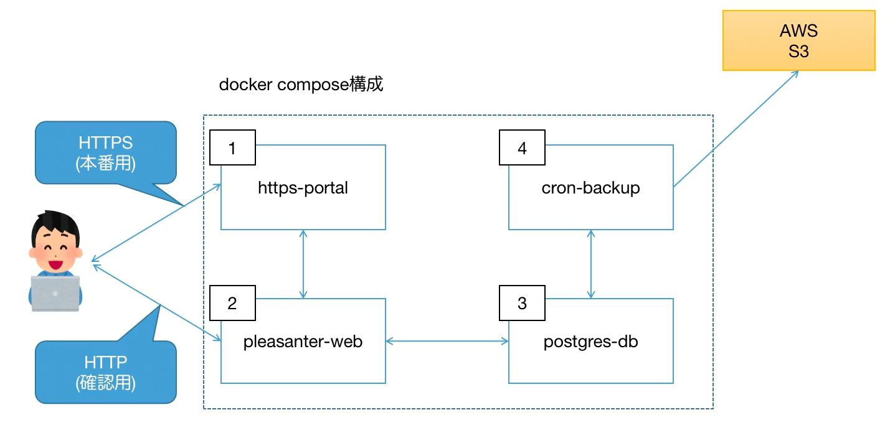

## これは何

Pleasanter を PostgreSQL と一緒に Docker Compose で動かすための構成です。
このリポジトリでは、Pleasanter 本体に加えて以下をまとめて扱えます。

- PostgreSQL
- CodeDefiner による初期 DB 定義投入
- `cron-backup` コンテナによるバックアップ

セットアップの考え方は Pleasanter 公式の Docker 手順と、既存の Qiita 記事を参考にしつつ、このリポジトリの現在の構成に合わせて整理しています。

## 前提

- Docker / Docker Compose が使えること
- ローカルアクセスは `http://localhost:50001/`
- PostgreSQL はホストから `127.0.0.1:5432` で参照可能

## 構成

- `postgres-db`
  - PostgreSQL 本体
- `pleasanter-web`
  - Pleasanter Web アプリ
- `codedefiner`
  - DB 定義の初期化用
- `cron-backup`
  - ダンプ / PITR バックアップ実行用

## 全体構造



図に対応するコンテナ一覧:

| No | コンテナ名 | 概要 | 定義ファイル |
| --- | --- | --- | --- |
| 1 | `https-portal` | HTTPS 通信用。Let's Encrypt を用いた証明書取得の自動化 | `docker-compose.https-portal.yml` |
| 2 | `pleasanter-web` | Pleasanter の Web システム | `docker-compose.yml` |
| 3 | `postgres-db` | PostgreSQL DB。Pleasanter が使用するデータベース | `docker-compose.yml` |
| 4 | `cron-backup` | バックアップ用の cron プログラムを格納 | `docker-compose.yml` |

全体の説明:

- 利用者は通常 `pleasanter-web` に HTTP でアクセスして Pleasanter を利用します
- 本番で SSL を使う場合は `https-portal` が前段に入り、HTTPS 終端と証明書管理を担当します
- `pleasanter-web` は内部ネットワーク経由で `postgres-db` に接続し、Pleasanter のデータを読み書きします
- `cron-backup` は `postgres-db` のデータ領域とアーカイブログを参照してバックアップを作成します
- S3 バックアップを有効にした場合は、`cron-backup` から AWS S3 にバックアップを転送します

各コンテナの役割:

- `1. https-portal`
  - 本番運用で HTTPS 終端を担当します
  - 外部からの HTTPS アクセスを受けて `pleasanter-web` へ転送します
- `2. pleasanter-web`
  - ユーザーが直接利用する Pleasanter 本体です
  - 確認用途では HTTP で `localhost:50001` へ直接アクセスできます
- `3. postgres-db`
  - Pleasanter のデータを保持する PostgreSQL です
  - `pleasanter-web` と `cron-backup` から内部ネットワーク経由で参照されます
- `4. cron-backup`
  - 定期バックアップと復元補助を担当します
  - `postgres-db` のデータ領域と WAL 領域を参照し、必要に応じて S3 へも同期します

## 設定ファイル

設定は 2 ファイルに分けています。

- `.env`
  - Git 管理してよい非秘匿設定
- `.env.secrets`
  - パスワードや接続文字列などの秘匿情報

### `.env`

```env
# PostgreSQL のメジャーバージョン
POSTGRES_VERSION=18

# PostgreSQL データディレクトリのマウント先
POSTGRES_VOLUMES_TARGET=/var/lib/postgresql/data

# WAL アーカイブログの配置先
POSTGRES_ARCLOG_PATH=/var/lib/postgresql/arclog

# PostgreSQL 管理者ユーザー名
POSTGRES_USER=postgres

# 初期化時に作成するデータベース名
POSTGRES_DB=postgres

# ホスト認証方式
POSTGRES_HOST_AUTH_METHOD=scram-sha-256

# initdb に渡す追加引数
POSTGRES_INITDB_ARGS="--auth-host=scram-sha-256"

# バックアップ系スクリプトが接続する PostgreSQL ホスト名
BACKUP_DB_HOST=postgres-db

# バックアップ系スクリプトが接続する PostgreSQL ポート番号
BACKUP_DB_PORT=5432

# バックアップ系スクリプトが接続する PostgreSQL ユーザー名
BACKUP_DB_USER=postgres

# Pleasanter コンテナのバージョン
PLEASANTER_VERSION=latest
POSTGRES_LISTEN_ADDRESSES=*
POSTGRES_ARCHIVE_MODE=on
POSTGRES_WAL_LEVEL=replica
POSTGRES_ARCHIVE_COMMAND=cp %p /var/lib/postgresql/arclog/%f
```

### `.env.secrets`

`.env.secrets.example` をコピーして作成します。

```bash
cp .env.secrets.example .env.secrets
```

例:

```env
# PostgreSQL の管理者ユーザー postgres のパスワード
POSTGRES_PASSWORD=change_me

# pg_dumpall の 7z 暗号化に使うパスワード
ZIP_PASSWORD=change_me

# CodeDefiner / Pleasanter が PostgreSQL 管理者で接続するための接続文字列
Implem.Pleasanter_Rds_PostgreSQL_SaConnectionString=Server=postgres-db;Database=postgres;UID=postgres;PWD=change_me

# CodeDefiner / Pleasanter が Owner ユーザーで接続するための接続文字列
Implem.Pleasanter_Rds_PostgreSQL_OwnerConnectionString=Server=postgres-db;Database=#ServiceName#;UID=#ServiceName#_Owner;PWD=change_me

# CodeDefiner / Pleasanter が User ユーザーで接続するための接続文字列
Implem.Pleasanter_Rds_PostgreSQL_UserConnectionString=Server=postgres-db;Database=#ServiceName#;UID=#ServiceName#_User;PWD=change_me
```

## 起動手順

### 1. イメージをビルド

```bash
docker compose build
```

### 2. DB 定義を初期化

```bash
docker compose run --rm codedefiner _rds /y /l "ja" /z "Asia/Tokyo"
```

### 3. Pleasanter を起動

```bash
docker compose up -d
```

### 4. 動作確認

ブラウザで以下を開きます。

- `http://localhost:50001/`

初期ログイン情報:

| ユーザ | パスワード |
| --- | --- |
| `Administrator` | `pleasanter` |

## SSL で起動する

SSL 化には [docker-compose.https-portal.yml](./docker-compose.https-portal.yml) を使います。構成としては、Qiita 記事にある通り `https-portal` が `pleasanter-web` の前段に入り、Let's Encrypt 証明書の取得と HTTPS 終端を担当します。

事前条件:

- 公開ドメイン名があること
- そのドメインがこのホストへ向いていること
- 80/tcp と 443/tcp が外部から到達可能なこと

### 1. `docker-compose.https-portal.yml` を修正

最低限、以下を自分の環境に合わせて変更します。

```yaml
environment:
  DOMAINS: "example.com -> http://pleasanter-web"
  STAGE: "production"
```

ポイント:

- `DOMAINS`
  - `example.com` を実際のドメインへ変更
- `STAGE`
  - コメントアウトのままだと自己署名証明書相当の動作
  - `production` を指定すると Let's Encrypt を使う

### 2. HTTPS 用サービスを含めて起動

```bash
docker compose -f docker-compose.yml -f docker-compose.https-portal.yml up -d
```

### 3. アクセス確認

ブラウザで以下へアクセスします。

- `https://<あなたのドメイン>/`

補足:

- Let's Encrypt のドメイン認証のため、80 番ポートも必要です
- 証明書再取得が必要な場合は `FORCE_RENEW: 'true'` を一時的に使います
- 大きなファイルを扱う場合は `CLIENT_MAX_BODY_SIZE` を調整します

## 運用メモ

- `postgres-db` は healthcheck を持ち、`pleasanter-web` / `codedefiner` / `cron-backup` は DB ready を待って起動します。
- DB ポート公開は `127.0.0.1:5432:5432` に限定しています。
- `container_name` は固定していないため、同じホストで別 project 名の Compose を並行起動しやすい構成です。

## バックアップ / 復元

バックアップと復元の手順は別ファイルに分離しています。

- [バックアップ / 復元手順](./doc/backup-restore.md)

## 参考

- [Pleasanter 公式: Dockerで起動する](https://pleasanter.org/ja/manual/getting-started-pleasanter-docker)
- [Qiita: pleasanter+PostgreSQL+SSL+docker な構成を作ってみた](https://qiita.com/yamada28go/items/b9e6acdb4cca9572c7a6)
- [Qiita: Dockerでバックアップを含む Pleasanter + PostgreSQL 環境を組んでみた](https://qiita.com/yamada28go/items/fe8f85305d388ad30a60)
